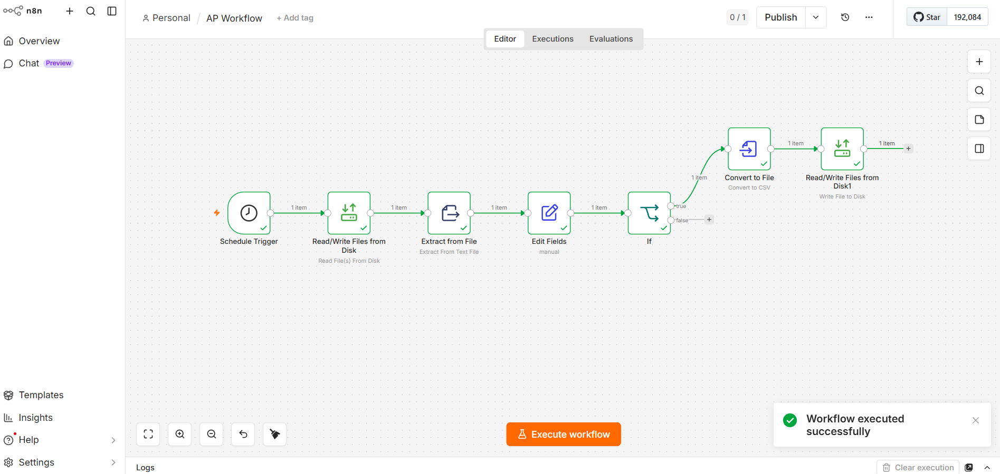
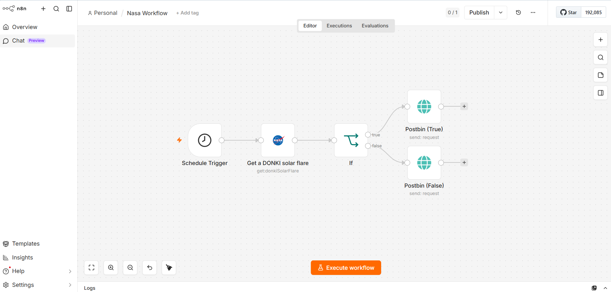
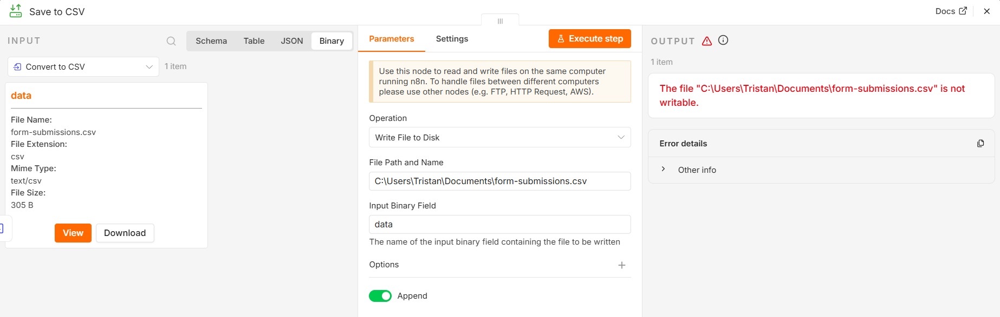
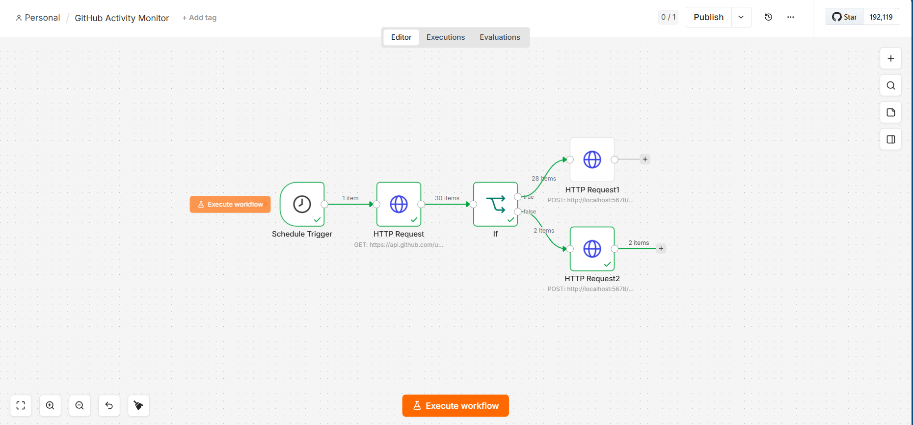

[n8n-README.md](https://github.com/user-attachments/files/28851759/n8n-README.md)
# n8n Automation Workflows

A collection of real-world automation workflows built with [n8n](https://n8n.io) — an open-source, self-hostable workflow orchestration platform.

These workflows are designed around practical business scenarios: file processing, data transformation, conditional routing, and scheduled automation.

---

## ✅ AP Workflow — Automated Data Pipeline



A scheduled automation that reads structured data from disk, extracts and transforms fields, applies conditional logic, and outputs a clean CSV file — entirely hands-free.

**Workflow Steps:**

| Step | Node | What it does |
|---|---|---|
| 1 | Schedule Trigger | Runs the workflow automatically on a set schedule |
| 2 | Read/Write Files from Disk | Reads the source data file from local storage |
| 3 | Extract from File | Parses and extracts content from the text file |
| 4 | Edit Fields | Manually maps and transforms the extracted fields |
| 5 | If (conditional) | Routes data based on business logic — true/false branching |
| 6 | Convert to File | Converts the processed data to CSV format |
| 7 | Write File to Disk | Saves the final output file to disk |

**Key concepts demonstrated:**
- ⏱ Scheduled automation (no manual trigger needed)
- 🔀 Conditional branching (If/true/false routing)
- 🔄 File I/O — read, transform, write pipeline
- 📄 Data format conversion (raw text → structured CSV)

---

## 📦 How to Import a Workflow

1. Open your n8n instance
2. Go to **Workflows → New**
3. Click the **⋯ menu → Import from File**
4. Select the `.json` file from the `workflows/` folder
5. Update any credentials or file paths to match your environment
6. Click **Execute workflow** to test

---

## 🛠 Setup

These workflows run on a self-hosted n8n instance. To get started locally:

```bash
# Using npx (quickest)
npx n8n

# Using Docker
docker run -it --rm \
  --name n8n \
  -p 5678:5678 \
  -v ~/.n8n:/home/node/.n8n \
  docker.n8n.io/n8nio/n8n
```

Then open `http://localhost:5678` in your browser.

---

## 🗺 Roadmap

Workflows being added:

- [ ] HTTP API polling → database insert pipeline
- [ ] Email trigger → data extraction → Slack notification
- [ ] Webhook receiver → conditional processing → CSV report
- [ ] LLM-powered document classifier (n8n + Ollama integration)
- [ ] Scheduled web scraper → structured data output

---

---

## 🛰 NASA Workflow — Live API Monitor



A scheduled workflow that queries NASA's DONKI API for solar flare 
data, evaluates the result, and routes to separate endpoints 
based on whether data was returned.

**Workflow Steps:**

| Step | Node | What it does |
|---|---|---|
| 1 | Schedule Trigger | Runs automatically on a defined schedule |
| 2 | Get a DONKI solar flare | Calls NASA's live Space Weather API |
| 3 | If (conditional) | Checks if solar flare data exists |
| 4 | Postbin (True) | Sends data to endpoint if flare detected |
| 5 | Postbin (False) | Sends fallback request if no data found |

**Key concepts demonstrated:**
- 🌐 External REST API integration (NASA DONKI)
- 🔀 Conditional routing based on API response
- 📡 Webhook output via Postbin
- ⏱ Fully scheduled — zero manual intervention

---

---

## 🛰 Github Activity Monitor Workflow — Live API Monitor



A scheduled workflow that Poll your own GitHub API every hour then 
log new commits, evaluates the result, and routes to separate endpoints 
based on whether data was returned.


## 🔗 Related Projects

- [langchain-ollama-projects](https://github.com/tristanSilva/langchain-ollama-projects) — Local LLM experiments with LangChain + Ollama, including NagaBot (CLI chatbot with persistent memory)

---

---

## 🛰 Form Submission Handler Workflow — Live API Monitor



## 👤 About

Built by **Tristan Silva** — AI Automation Engineer, specializing in RPA, LLM engineering, and intelligent workflow automation.

📍 Naga City, Philippines

[](https://linkedin.com/in/silvatristanv)
